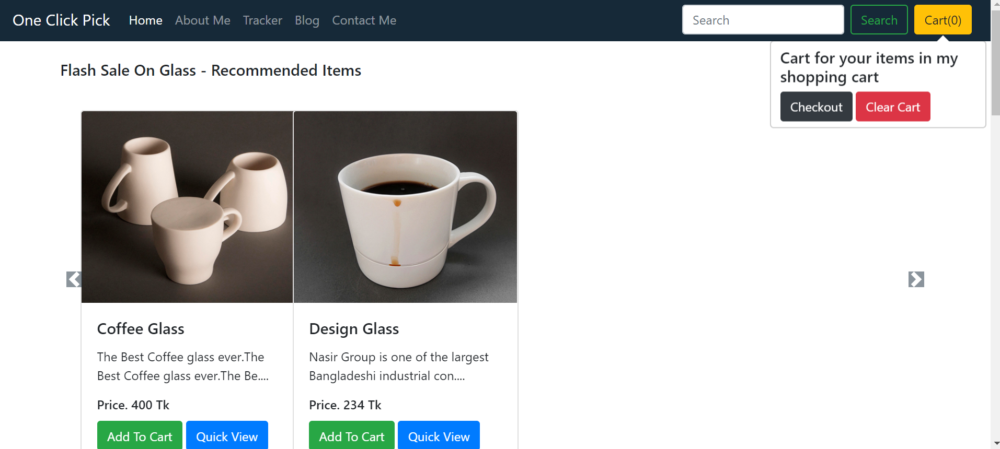
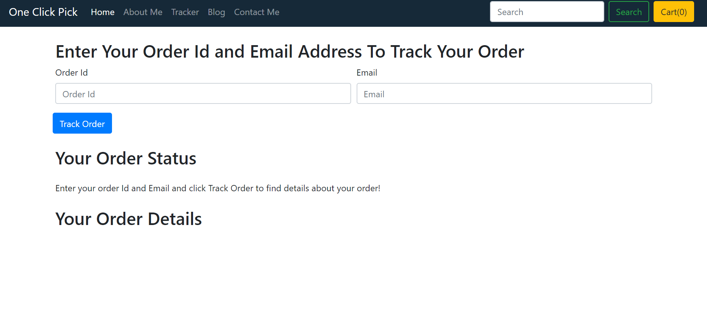
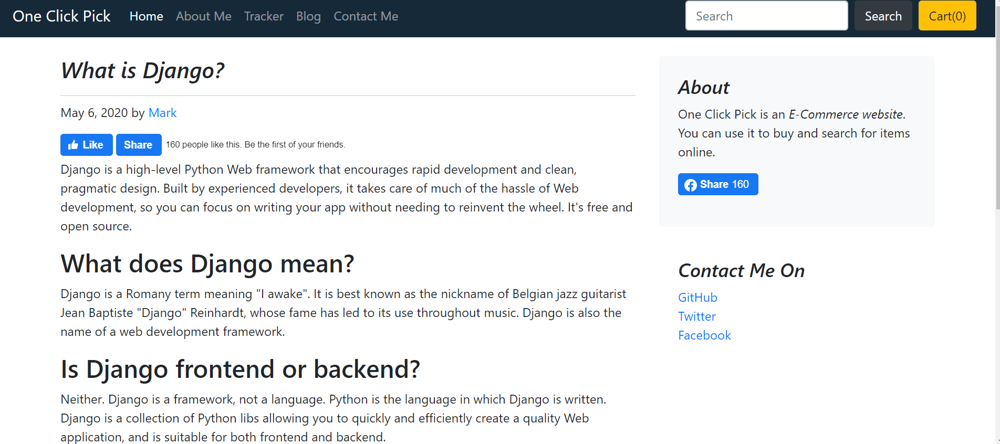

# OneClick_Pick
*One-Click Pick is an E-commerce Webite and Also have a Blog. A user can buy any product from this site. User must have logged in to buy product, can add products into cart without login. User can track their orders.*

# Features
* Create order
* Shipped order
* Clear cart
* Update cart
* Contact with seller
* Tracking order
* Blog
* Product view
* Facebook plugin
* etc,....

### Integrating Payment Gateway - PayTM.
- Create a Merchant account on PayTM to integrate.
- Don't share your MID.
- And also don't share MERCHANT_KEY = ''

# Tools
## Front-end Part
* HTML
* CSS
* Bootstrap
* JavaScript
## Back-end
* Django
* SQLite 3

# Screenshots of the Project

  
  
  

**Copyright (c)** 2020-3020 Md. Omar Faruk

## Go Through This Site Then You Will Know About This Site Properly.

